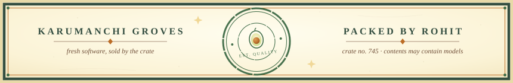

  

<table width="100%">
  <tr>
    <td width="26%" align="right"><b>Languages</b></td>
    <td>
      
      
      
      
    </td>
  </tr>
  <tr>
    <td align="right"><b>AI &amp; Agents</b></td>
    <td>
      
      
      
      
      
    </td>
  </tr>
  <tr>
    <td align="right"><b>On-device ML</b></td>
    <td>
      
      
      
    </td>
  </tr>
  <tr>
    <td align="right"><b>Data &amp; Pipelines</b></td>
    <td>
      
      
      
      
      
    </td>
  </tr>
  <tr>
    <td align="right"><b>Mobile</b></td>
    <td>
      
      
    </td>
  </tr>
</table>

<i>I work at the seam between machine learning and systems — models that fit in memory, answer in milliseconds, and never phone home.</i>

 

<table width="100%">
  <tr>
    <td width="50%" valign="top">
      <h4 align="center"><a href="https://github.com/rohitkarumanchi745/pyrit-redteam-harness">🧪 pyrit-redteam-harness</a></h4>
      
An LLM red-teaming harness built on PyRIT — attack orchestration and scoring, so failure modes surface in the lab, not in front of users.

      
 

    </td>
    <td width="50%" valign="top">
      <h4 align="center"><a href="https://github.com/rohitkarumanchi745/nava-dating-backend-main">⚙️ nava-dating-backend-main</a></h4>
      
The high-performance backend behind the Nava dating app — Rust in the hot path, latency budgets taken personally.

      
 

    </td>
  </tr>
  <tr>
    <td width="50%" valign="top">
      <h4 align="center"><a href="https://github.com/rohitkarumanchi745/navaswift-ui-iOS-">📱 navaswift-ui-iOS-</a></h4>
      
Nava's native iOS client, written in Swift — front of house to the Rust kitchen next door.

      
 

    </td>
    <td width="50%" valign="top">
      <h4 align="center"><a href="https://github.com/rohitkarumanchi745/rohit-portfolio">🗂️ rohit-portfolio</a></h4>
      
Personal site and portfolio — the long-form edition of this page.

      
 

    </td>
  </tr>
</table>

 

<h3>📒 The Grove Ledger</h3>
<i>the season's numbers, straight from the orchard books</i>
  

  

  

- **1–2-bit LLM prototypes** — pushing BitNet-style quantization toward fully offline, on-device inference; how far can a model shrink before it stops earning its keep?
- **Edge-side learning** — federated and reinforcement learning that improve on the device, without ever centralizing the data.

status: checked daily; still firm.

 

<h3>📬 How to Reach the Grove</h3>

  

