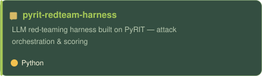
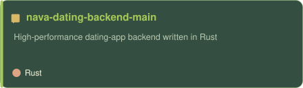
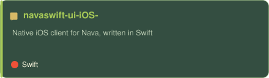
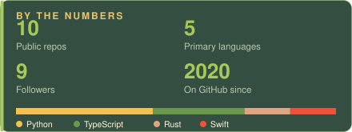

<picture>
  <source media="(prefers-color-scheme: dark)" srcset="https://readme-typing-svg.demolab.com?font=Playfair+Display&size=19&duration=3500&pause=1000&color=A7C957&center=true&vCenter=true&width=720&height=34&lines=high-performance+backends+in+Rust%2C+Python+%26+Java;AI+agents+with+LangGraph%2C+LangChain+%26+MCP+servers;BitNet-style+low-bit+LLMs+%C2%B7+fully+on-device" />
  
</picture>

<b>LANGUAGES</b>

<b>BACKEND &amp; MOBILE</b>

<b>AI &amp; AGENTS</b>

<b>ON-DEVICE ML</b>

<b>DATA &amp; PIPELINES</b>

<picture>
  <source media="(prefers-color-scheme: dark)" srcset="https://raw.githubusercontent.com/rohitkarumanchi745/rohitkarumanchi745/output/snake-dark.svg">
  
</picture>

- **1–2-bit LLM prototypes** — pushing BitNet-style quantization toward fully offline, on-device inference; how far can a model shrink before it stops earning its keep?
- **Edge-side learning** — federated and reinforcement learning that improve on the device, without ever centralizing the data.

<i>status: checked daily; still firm.</i>

